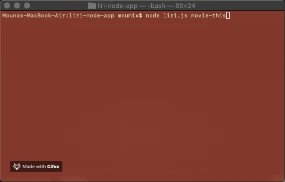

# **LIRI-BOT (a Language Interpretation and Recognition Interface)**

LIRI is a command line node app that takes in the following parameters and gives you back data:

````
* concert-this
* spotify-this-song
* movie-this
* do-what-it-says
````

# **Getting Started:**

## **1- concert-this:**

`node liri.js concert-this <artist/band name>`


This will search the Bands in Town Artist Events API for an artist and render the following information about each event to the terminal:

* Name of the venue
* Venue location
* Date of the Event (use moment to format this as "MM/DD/YYYY")

## **2- Spotify-this-song:**

`node liri.js spotify-this-song <song name>`


This will show the following information about the song in your terminal/bash window

* Artist(s)
* The song's name
* A preview link of the song from Spotify
* The album that the song is from

_If no song is provided the search will default "That's What I Like"._ 

## **3- movie-this:**

`node liri.js movie-this <movie name>`



This will output the following information to your terminal/bash window:

* Title of the movie.
* Year the movie came out.
* IMDB Rating of the movie.
* Rotten Tomatoes Rating of the movie.
* Country where the movie was produced.
* Language of the movie.
* Plot of the movie.
* Actors in the movie.

_If no movie name the search will default "Mr. Nobody"._

## **4- do-what-it-says:**

`node liri.js do-what-it-says`


LIRI will use the text from “random.txt” and call on of LIRI’s commands. It should run movie-this for "Bullitt".

## **Technologies used:** 👩‍💻

* NPM packages
* Spotify API
* OMDB API
* Bands In Town API
* Node.js
* Javascript

